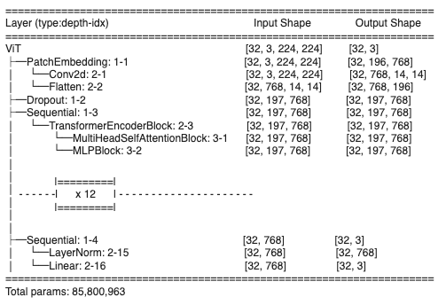

## **Paper Replication:**
### An Image is Worth 16x16 Words: Transformers For Image Recognition at Scale

Paper:
https://arxiv.org/abs/2010.11929

This is a PyTorch implementation of the vision transformer architecture outlined in the paper above. The layer shapes and general architecture remain faithful to the paper, though the modules contained differ in detail. At present, the dataset associated with this NB is sufficient for testing successful training, but is insufficient for the classification task it presents. Future efforts will see larger datasets and analysis of model training and validation. 

<figure style="display: inline-block; text-align: center; margin-right: 20px;">
    <figcaption style="margin-bottom: 10px;">Architecture Overview</figcaption>
    
</figure>
<figure style="display: inline-block; text-align: center;">
    <figcaption style="margin-bottom: 10px;">Layer Details</figcaption>
    
</figure>